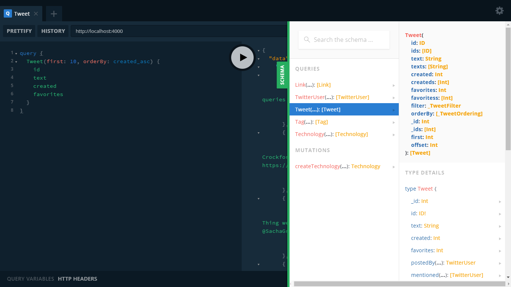

# GraphQL Community Graph

## With Multiple Bindings

Using the following typeDefs for your local Neo4j server:

```text
const typeDefs = `
  type Technology @model {
    name: String! @unique
    integration: [Technology] @relation(
      name: "HAPPINESS", 
      direction: OUT
    )
  }
`;
```

The following is a modified version of the [twitter schema](https://github.com/grand-stack/grand-stack-starter/blob/twitter/api/src/graphql-schema.js) from the [GraphQL Community Graph](http://graphql.communitygraph.org/). Each type has received a `@model` directive. There are no further changes made because the endpoint is **read-only** and thus does not allow the schema or data to be modified.

```text
const twitterTypeDefs = `
  type Link @model {
    url: ID!
  }
  type TwitterUser @model {
    id: ID!
    screen_name: String!
    name: String
    location: String
    followers: Int
    following: Int
    statuses: Int
    profile_image_url: String
    posted: [Tweet] @relation(name:"POSTED", direction:"OUT")
  }
  type Tweet @model {
    id: ID!
    text: String
    created: Int
    favorites: Int
    postedBy: TwitterUser @relation(name:"POSTED", direction:"IN")
    mentioned: [TwitterUser] @relation(name:"MENTIONED", direction:"OUT")
    reply: Tweet @relation(name:"REPLIED_TO", direction:"OUT")
    retweeted: Tweet @relation(name:"RETWEETED", direction:"OUT")
    links: [Link] @relation(name:"LINKED", direction:"OUT")
    tags: [Tag] @relation(name:"TAGGED", direction:"OUT")
  }
  type Tag @model {
    name: ID!
    tagged: [Tweet] @relation(name:"TAGGED", direction:"IN")
  }
`;
```

Now we can setup the server, using `typeDefs` for our local Neo4j instance and `twitterTypeDefs` for the remote GraphQL Community Graph. 

```text
import { v1 as neo4j } from 'neo4j-driver';
import { Neo4jGraphQLServer } from '../michaeldgraham/neo4j-graphql-binding/src/index.js';

const driver = neo4j.driver(
  process.env.NEO4J_URI || "bolt://localhost:7687",
  neo4j.auth.basic(
    process.env.NEO4J_USER || "neo4j",
    process.env.NEO4J_PASSWORD || "neo4j"
  )
);

const GraphQLCommunityGraphDriver = neo4j.driver(
  "bolt://107.170.69.23:7687",
  neo4j.auth.basic("graphql", "graphql")
);

const server = Neo4jGraphQLServer({
  typeDefs: typeDefs,
  driver: driver,
  log: true,
  bindings: {
    twitter: {
      typeDefs: twitterTypeDefs,
      driver: GraphQLCommunityGraphDriver,
      readOnly: true
    }
  }
});

server.listen().then( ({ url }) => {
  console.log(`🚀 Server ready at ${url}`);
});

```

Notice the `readOnly` parameter set to `true` in the configuration object for the `twitter` binding because the GraphQL Community Graph server only provides read access. 

We can now __use the same auto-generated query types produced by the Neo4j-GraphQL extension to read data from the remote GraphQL Community Graph while also using a binding to manage a local Neo4j instance. 



### Remote Query

This query obtains the first 5 most recently created Tweets that contain exactly the text "GRANDstack". 

`Request`

```text
query {
  Tweet(
    first: 5, 
    orderBy: created_desc, 
    filter: { text_contains: "GRANDstack" }
   ) {
    id
    text
  }
}
```

`Response`

```text
{
  "data": {
    "Tweet": [
      {
        "id": "1012693204834177024",
        "text": "RT @sfrechette: Just found out about this today ;-) 
        GRANDstack - Build full stack graph applications with ease. 
        https://t.co/Mjprm3ZmHo #gr…"
      },
      {
        "id": "1012690404418846720",
        "text": "RT @sfrechette: Just found out about this today ;-) 
        GRANDstack - Build full stack graph applications with ease. 
        https://t.co/Mjprm3ZmHo #gr…"
      },
      {
        "id": "1012377131911909376",
        "text": "Just found out about this today ;-) GRANDstack - 
        Build full stack graph applications with ease.… 
        https://t.co/Q002zqbbSf"
      },
      {
        "id": "1012105013399654400",
        "text": "@BennyOgidan @neo4j There’s still time to build 
        something for the GRANDstack hackathon!\n\n 
        https://t.co/4gcLJQwFb5"
      },
      {
        "id": "1009073016687480834",
        "text": "RT @mesirii: The #GRANDstack blog got a little make-over.
        Hope it makes it easier to find things.\n\n
        https://t.co/FeDlR6MwLZ\n\nLet us know if…"
      }
    ]
  }
}
```

### Local Mutation

```text
mutation {
  createTechnology(
    data: {
      name: "Apollo",
      integration: {
        create: [
          {
            name: "GraphQL",
            integration: {
              create: [
                {
                  name: "Neo4j",
                  integration: {
                    connect: [
                      {
                        name: "Apollo"
                      }
                    ]
                  }
                }
              ]
            }
          }
        ]
      }
    }
  ) {
    id		
    name
    integration {
      id
      name
      integration {
        id
        name
        integration {
          id
          name
        }
      }
    }
  }
}
```

## With neo4j-graphql-js

If...


