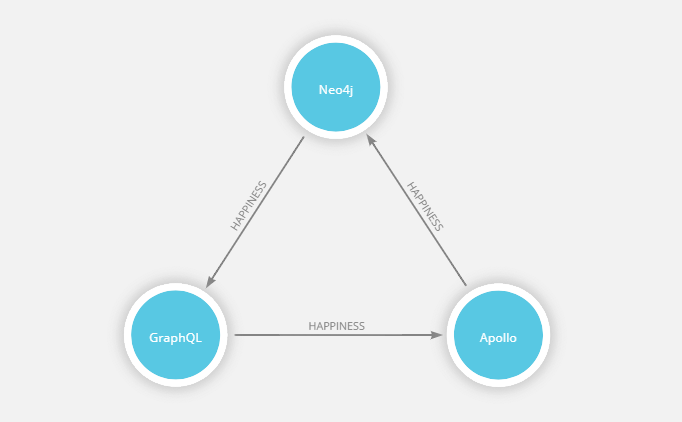

# Neo4j GraphQL Server

## Overview

Neo4jGraphQLServer uses Apollo Server and all the exports of `neo4j-graphql-binding` to get started quickly. Assuming default configurations, `neo4jIDL` and `neo4jAssertConstraints` are first used to update your Neo4j-GraphQL schema and support a `@unique` directive. Next, `buildNeo4jTypeDefs` is used to augment your typeDefs. A GraphQL Binding to your Neo4j-GraphQL endpoint is then created using `neo4jGraphQLBinding`. This binding is added into your server's context object, by default at the key 'neo4j', so you can access it the way you normally would access a GraphQL Binding.  
  
Once the binding is created, resolvers are generated using `buildNeo4jResolvers`, for any query or mutation type that was either generated by `buildNeo4jTypeDefs` or that has a @cypher directive. Each resolver uses the created binding to delegate all such operations to your Neo4j-GraphQL endpoint. Finally, the augmented `typeDefs` and `resolvers` are used in setting up Apollo Server.

## Quick Start

This example server setup uses only the query and mutation types generated from `buildNeo4jTypeDefs` and the corresponding resolvers from `buildNeo4jResolvers`. 

```text
import { Neo4jGraphQLServer } from 'neo4j-graphql-binding'
import { v1 as neo4j } from 'neo4j-driver';

const typeDefs = `
  type Technology @model {
    name: String! @unique
    integration: [Technology] @relation(
      name: "HAPPINESS", 
      direction: OUT
    )
  }
`;

const driver = neo4j.driver(
  process.env.NEO4J_URI || "bolt://localhost:7687",
  neo4j.auth.basic(
    process.env.NEO4J_USER || "neo4j",
    process.env.NEO4J_PASSWORD || "neo4j"
  )
);

const server = Neo4jGraphQLServer({
  typeDefs: typeDefs,
  driver: driver
});

server.listen().then( ({ url }) => {
  console.log(`🚀 Server ready at ${url}`);
});
```

If you navigate to [http://localhost:4000/](http://localhost:4000/), you should see GraphQL Playground.

### Nested Mutation

This example uses nested create and connect mutations and takes advantage of the @unique directive to create the following graph:



Run the following mutation:

```text
 mutation {
  createTechnology(
    data: {
      name: "Neo4j",
      integration: {
        create: [
          {
            name: "GraphQL",
            integration: {
              create: [
                {
                  name: "Apollo",
                  integration: {
                    connect: [
                      {
                        name: "Neo4j"
                      }
                    ]
                  }
                }
              ]
            }
          }
        ]
      }
    }
  ) {
    id		
    name
    integration {
      id
      name
      integration {
        id
        name
        integration {
          id
          name
        }
      }
    }
  }
}
```

Example result:

```text
{
  "data": {
    "createTechnology": {
      "id": "cjj0dr5i00006fgr0tfukv1tn",
      "name": "Neo4j",
      "integration": [
        {
          "id": "cjj0dr5i00007fgr05js3fg30",
          "name": "GraphQL",
          "integration": [
            {
              "id": "cjj0dr5i00008fgr06ugrjnze",
              "name": "Apollo",
              "integration": [
                {
                  "id": "cjj0dr5i00006fgr0tfukv1tn",
                  "name": "Neo4j"
                }
              ]
            }
          ]
        }
      ]
    }
  }
}
```

### Query

Now you can run the following query: 

```text
query {
  Technology(orderBy: name_desc) {
    id
    name
  }
}
```

resulting in:

```text
{
  "data": {
    "Technology": [
      {
        "id": "cjj0dr5i00006fgr0tfukv1tn",
        "name": "Neo4j"
      },
      {
        "id": "cjj0dr5i00007fgr05js3fg30",
        "name": "GraphQL"
      },
      {
        "id": "cjj0dr5i00008fgr06ugrjnze",
        "name": "Apollo"
      }
    ]
  }
}
```

## API Reference

All the same arguments as Apollo Server are supported, in addition to the following:

* `typeDefs` \(required\): Your GraphQL type definitions in SDL format 
* `driver`\(required\): Your Neo4j driver instance \(More info [here](https://www.npmjs.com/package/neo4j-driver)\). 
* `calls`
  * `idl` \(default: `true`\): A boolean controlling whether to call `neo4jIDL` during setup
  * `assert` \(default: `true`\): A boolean controlling whether to call `neo4jAssertConstraints` during setup. This provides support for the `@unique` directive. 
* `augment` Configures the use of `buildNeo4jTypeDefs` and `buildNeo4jResolvers` during setup. 
  * `typeDefs`
    * `query` \(default: `true`\) A boolean controlling the generation of query types.
    * `mutation` \(default: `true`\) A boolean controlling the generation of mutation types.
  * `resolvers`
    * `query` \(default: `true`\) A boolean controlling the generation of resolvers for query types.
    * `mutation` \(default: `true`\) A boolean controlling the generation of resolvers for mutation types. 
* `indexConfig`
  * `use` \(default: `'cuid'`\) Configures what method to use when generating id field values.  
* `localBindingKey` \(default: `'neo4j'`\): The key used when storing the created binding into the server's context object. 
* `log` \(default: `false`\): Logs results from query or mutation operations, `buildNeo4jTypeDefs`,`neo4jAssertConstraints`, and `neo4jIDL`

### Full Configuration

```text
Neo4jGraphQLServer({
  typeDefs: typeDefs,
  resolvers: resolvers,
  driver: driver,
  calls: {
    assert: true, 
    idl: true
  },
  augment: {
    typeDefs: {
      query: true,
      mutation: true
    },
    resolvers: {
      query: true, 
      mutation: true
    }
  },
  log: true, 
  localBindingKey: 'neo4j'
});
```

